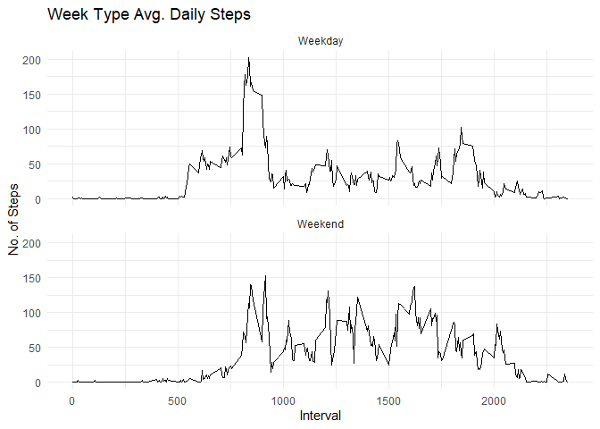

```r
library("data.table")
library(ggplot2)
```

## Loading and preprocessing the data

```r
fileUrl <- "https://d396qusza40orc.cloudfront.net/repdata%2Fdata%2Factivity.zip"
download.file(fileUrl, destfile = paste0(getwd(), '/repdata%2Fdata%2Factivity.zip'), method = "curl")
unzip("repdata%2Fdata%2Factivity.zip",exdir = "repdata")
```


```r
activity <- data.table::fread(input = "repdata/activity.csv")
head(activity)
```

```
##    steps       date interval
## 1:    NA 2012-10-01        0
## 2:    NA 2012-10-01        5
## 3:    NA 2012-10-01       10
## 4:    NA 2012-10-01       15
## 5:    NA 2012-10-01       20
## 6:    NA 2012-10-01       25
```

## What is mean total number of steps taken per day?
1. Get the total number of steps taken daily.


```r
daily_steps <- activity[, c(lapply(.SD, sum, na.rm = FALSE)), .SDcols = c("steps"), by = .(date)] 
head(daily_steps)
```

```
##          date steps
## 1: 2012-10-01    NA
## 2: 2012-10-02   126
## 3: 2012-10-03 11352
## 4: 2012-10-04 12116
## 5: 2012-10-05 13294
## 6: 2012-10-06 15420
```


```r
ggplot(daily_steps, aes(x = steps)) +
    geom_histogram(binwidth = 1000) + theme_minimal() +
    labs(title = "Daily Steps", x = "Steps", y = "Frequency")
```

```
## Warning: Removed 8 rows containing non-finite values (`stat_bin()`).
```

<!-- -->

2. The mean of daily steps.

```r
daily_steps[, .(mean = mean(steps, na.rm = TRUE), median = median(steps, na.rm = TRUE))]
```

```
##        mean median
## 1: 10766.19  10765
```

## What is the average daily activity pattern?

```r
interval <- activity[, c(lapply(.SD, mean, na.rm = TRUE)), .SDcols = c("steps"), by = .(interval)] 

ggplot(interval, aes(x = interval , y = steps)) + geom_line() +
  theme_minimal() +
  labs(title = "Avg. Daily Steps", x = "Interval", y = "Avg. Steps per day")
```

<!-- -->

```r
head(interval)
```

```
##    interval     steps
## 1:        0 1.7169811
## 2:        5 0.3396226
## 3:       10 0.1320755
## 4:       15 0.1509434
## 5:       20 0.0754717
## 6:       25 2.0943396
```

## Imputing missing values
1. Calculate and report the total number of missing values in the dataset (i.e. the total number of rows with NA NAs)

```r
activity[is.na(steps), .N ]
```

```
## [1] 2304
```

```r
nrow(activity[is.na(steps),])
```

```
## [1] 2304
```
2. Devise a strategy for filling in all of the missing values in the dataset. The strategy does not need to be sophisticated. For example, you could use the mean/median for that day, or the mean for that 5-minute interval, etc.


```r
activity[is.na(steps), "steps"] <- activity[, c(lapply(.SD, median, na.rm = TRUE)), .SDcols = c("steps")]
```
3. Create a new dataset that is equal to the original dataset but with the missing data filled in.


```r
data.table::fwrite(x = activity, file = "repdata/tidyData.csv", quote = FALSE)
```
4. Make a histogram of the total number of steps taken each day and calculate and report the mean and median total number of steps taken per day. Do these values differ from the estimates from the first part of the assignment? What is the impact of imputing missing data on the estimates of the total daily number of steps?


```r
total_steps <- activity[, c(lapply(.SD, sum)), .SDcols = c("steps"), by = .(date)]
total_steps[, .(mean = mean(steps), median = median(steps))]
```

```
##       mean median
## 1: 9354.23  10395
```

```r
ggplot(total_steps, aes(x = steps)) + geom_histogram(binwidth = 1000) +
  theme_minimal() +
  labs(title = "Daily Steps", x = "Steps", y = "Frequency")
```

<!-- -->

Estimate Type | Mean Steps | Median Steps
--- | --- | ---
With na | 10766.19 | 10765
Fillin na with median | 9354.23 | 10395

## Are there differences in activity patterns between weekdays and weekends?

```r
activity <- data.table::fread(input = "repdata/activity.csv")
activity[, date := as.POSIXct(date, format = "%Y-%m-%d")]
activity[, `Day`:= weekdays(x = date)]
activity[grepl(pattern = "Monday|Tuesday|Wednesday|Thursday|Friday", x = `Day`), "Week Type"] <- "Weekday"
activity[grepl(pattern = "Saturday|Sunday", x = `Day`), "Week Type"] <- "Weekend"
activity[, `Week Type` := as.factor(`Week Type`)]

activity[is.na(steps), "steps"] <- activity[, c(lapply(.SD, median, na.rm = TRUE)), .SDcols = c("steps")]
interval <- activity[, c(lapply(.SD, mean, na.rm = TRUE)), .SDcols = c("steps"), by = .(interval, `Week Type`)] 

ggplot(interval , aes(x = interval , y = steps, color=`Week Type`)) + geom_line(colour = 'black') + 
  theme_minimal() +
  labs(title = "Week Type Avg. Daily Steps", x = "Interval", y = "No. of Steps") + facet_wrap(~`Week Type` , ncol = 1, nrow=2)
```

<!-- -->

